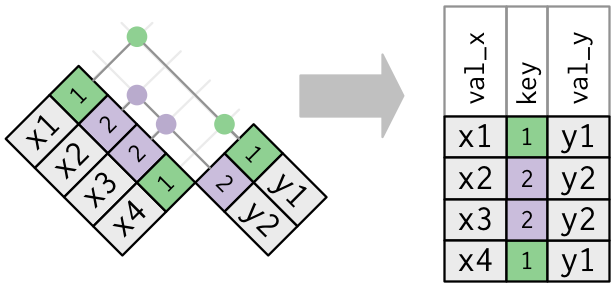

```{r echo = FALSE, include = FALSE, cache = FALSE}
knitr::opts_chunk$set(
  tidy = TRUE,
  tidy.opts = list(blank = FALSE, width.cutoff = 50),
  cache = 1
)
knitr::knit_hooks$set(
  source = function(x, options) {
    if (options$engine == 'R') {
      # format R code
      x = highr::hilight(x, format = 'html')
    } else if (options$engine == 'bash') {
      # format bash code
      x = paste0('<span class="hl std">$</span> ',
                 unlist(stringr::str_split(x, '\\n')),
                 '\n',
                 collapse = '')
    }
    x = paste(x, collapse = "\n")
    sprintf(
      "<div class=\"%s\"><pre class=\"%s %s\"><code class=\"%s %s\">%s</code></pre></div>\n",
      'sourceCode',
      'sourceCode',
      tolower(options$engine),
      'sourceCode',
      tolower(options$engine),
      x
    )
  }
)
```


```{r echo = FALSE, message = FALSE, cache = FALSE}
library(tidyverse)
```


This session
==================================
* Earlier: Data visualization with `ggplot2`

* Now: Tidying and summarizing data with `dplyr` and `tidyr`
    * Single table operations
    * In-class exercises
    * Joins
    * In-class exercises
* Later: Acquiring (tabular) data (*briefly covered*)


Tidying and summarizing data
============================
* Single table operations
* Joins


dplyr
=====

```{r}
library(tidyverse) # or library(dplyr)
```


```{r echo=FALSE}
set.seed(2)
d <- mpg %>% sample_n(4) %>% select( cty, hwy, cyl, displ )
```

* When working with data you must:
    * Figure out what you want to do.
    * Describe those tasks in the form of a computer program.
    * Execute the program.
* The `dplyr` package makes these steps fast and easy:
    * By constraining your options, it simplifies how you can think about common data manipulation tasks.
    * It provides simple "verbs", functions that correspond to the most common data manipulation tasks, to help you translate those thoughts into code.
    * It uses efficient data storage backends, so you spend less time waiting for the computer.

*Source: Introduction to dplyr vignette*

Pipe operator
=============

```{r}
(e <- exp(1))
log(e)
```

**Usage:** `log(x, base = exp(1))`

<div class="left">
```{r}
e %>% log
e %>% log()
e %>% log(.)
```
</div>
<div class="right">
```{r}
e %>% log(2)
e %>% log(base = 2)
e %>% log(., base = 2)
```
</div>

***

> Little bunny Foo Foo<br/>
> Went hopping through the forest<br/>
> Scooping up the field mice<br/>
> And bopping them on the head

<div class="left">
```{r eval=FALSE, tidy = FALSE}
bop(
  scoop(
    hop(foo_foo, through = forest),
    up = field_mice
  ), 
  on = head
)
```
</div>
<div class="right">
```{r eval = FALSE, tidy = FALSE}
foo_foo %>%
  hop(through = forest) %>%
  scoop(up = field_mouse) %>%
  bop(on = head)
```
</div>


```{r echo=FALSE}
library(stringr)
format.table <- function(d,e) {
  element <- function(name,qualifiers,code) {
    qualifiers <- ifelse(str_length(qualifiers)==0,'',str_c(' ',qualifiers))
    cat(paste0('<',name,qualifiers,'>'))
    lazyeval::lazy_eval(lazyeval::lazy(code))
    cat(paste0('</',name,'>\n'))
  }
  print_table <- function(.data,c.cols,r.cols) {
    cn <- colnames(.data)
    element('table','',{
      cat('\n')
      element('thead','',{
        cat('\n')
        element('tr','class="header"',{
          cat('\n')
          for (j in 1:ncol(.data)) {
            element('th',paste0('style="background:',c.cols[cn[j]],';"'),{
              cat(cn[j])
              }) 
          }
        })
      })
      element('tbody','',{
        cat('\n')
        for (i in 1:nrow(.data)) {
          element('tr','',{
            for (j in 1:ncol(.data)) {
              element('td',paste0('style="background:',r.cols[cn[j]],';"'),{
                cat(format(.data[i,j]%>%unlist))
                })
            }
          })
        }
      })
    }) 
  }
  all.colnames <- unique(c(colnames(d),colnames(e)))
  
  c.cols <- RColorBrewer::brewer.pal(length(all.colnames),'Pastel2')
  names(c.cols) <- all.colnames
  r.cols <- colorspace::hex(colorspace::mixcolor(.5,colorspace::hex2RGB(c.cols),colorspace::hex2RGB('#ffffff')))
  
  element('div','style="display:inline-block;width:40%;vertical-align:top;text-align:left"',{
    print_table(d,c.cols,r.cols)
  })
  element('div','style="display:inline-block;width:10%;vertical-align:top;text-align:center"',{
    cat('')
  })
  element('div','style="display:inline-block;width:40%;vertical-align:top;text-align:right"',{
    print_table(e,c.cols,r.cols)
  })
}
```

Single table operations
=======================

* Receive a data frame as input
* Return a data frame as output
    * Input data frame is unchanged

```{r eval=FALSE}
select
rename
mutate
arrange
summarise
group_by
```


Select a subset of columns
===========================

```{r eval = FALSE}
d %>% select( cty, hwy )
```

```{r results='asis', echo=FALSE}
format.table(d, d %>% select( cty, hwy ))
```

```{r eval = FALSE}
d %>% select( starts_with('c') )
```

```{r results='asis', echo=FALSE}
format.table(d, d %>% select( starts_with('c') ))
```

Rename or reorder columns
==========================
```{r eval = FALSE}
d %>% select( highway = hwy, everything(), -cyl )
```

```{r results='asis', echo=FALSE}
format.table(d, d %>% select( highway = hwy, everything(), -cyl ) )
```

```{r eval = FALSE}
d %>% rename( highway = hwy )
```

```{r results='asis', echo=FALSE}
format.table(d, d %>% rename( highway = hwy ))
```

Create new columns
==================
```{r eval = FALSE}
d %>% mutate( z = hwy / cty )
```

```{r results='asis', echo=FALSE}
format.table(d, d %>% mutate( z = hwy / cty ) )
```

```{r eval = FALSE}
d %>% mutate( sqrt(displ) )
```

```{r results='asis', echo=FALSE}
format.table(d, d %>% mutate( sqrt(displ) ) )
```


Sort rows
=========
```{r eval = FALSE}
d %>% arrange( cty, hwy )
```

```{r results='asis', echo=FALSE}
format.table(d, d %>% arrange( cty, hwy ))
```

```{r eval = FALSE}
d %>% arrange( desc(cty), hwy )
```

```{r results='asis', echo=FALSE}
format.table(d, d %>% arrange( desc(cty), hwy ) )
```

Keep a subset of rows
=======================
```{r eval = FALSE}
d %>% filter( cty == 11 )
```

```{r results='asis', echo=FALSE}
format.table(d, 
d %>% filter( cty == 11 )
             )
```

```{r eval = FALSE}
d %>% filter( hwy/cty > 1.4 )
```

```{r results='asis', echo=FALSE}
format.table(d, 
d %>% filter( hwy/cty > 1.4 )
             )
```

Summarise data
================
```{r eval = FALSE}
d %>% summarise( hwy = mean(hwy), cty = mean(cty) )
```

```{r results='asis', echo=FALSE}
format.table(d, 
d %>% summarise( hwy = mean(hwy), cty = mean(cty) )
             )
```

```{r eval = FALSE}
d %>% summarise_all(funs(mean))
```

```{r results='asis', echo=FALSE}
format.table(d, 
d %>% summarise_all(funs(mean))
             )
```

Grouping operations
===================

With `summarise`...

```{r eval = FALSE}
d %>% group_by( cyl ) %>% summarise_all(funs(mean))
```

```{r results='asis', echo=FALSE}
format.table(d, 
d %>% group_by( cyl ) %>% summarise_all(funs(mean))
             )
```

```{r eval = FALSE}
d %>% group_by( cty ) %>% summarise(mean(hwy),n())
```

```{r results='asis', echo=FALSE}
format.table(d, 
d %>% group_by( cty ) %>% summarise(mean(hwy),n())
             )
```

Grouping operations
===================

With `mutate`...

```{r eval = FALSE}
d %>% group_by( cyl ) %>% mutate(max(hwy))
```

```{r results='asis', echo=FALSE}
format.table(d, 
d %>% group_by( cyl ) %>% mutate(max(hwy))
             )
```

```{r eval = FALSE}
d %>% group_by( cty ) %>% mutate(displ = displ - mean(displ))
```

```{r results='asis', echo=FALSE}
format.table(d, 
d %>% group_by( cty ) %>% mutate(displ = displ - mean(displ))
             )
```

Grouping operations
===================

```{r eval = FALSE}
e %>% group_by(manufacturer,model) %>% summarise( cty = mean(cty), n = n() ) %>% filter( cty == max(cty) ) %>% rename( max_cty = cty )
```

```{r results='asis', echo=FALSE}
trunc.dots <- function(x,n){x <- format(as.data.frame(x%>%head(n)));x[n,] <- '...';x}
format.table(mpg %>% select( manufacturer, model, cty ) %>% trunc.dots(14),
mpg %>% select( manufacturer, model, cty ) %>% group_by(manufacturer,model) %>% summarise( cty = mean(cty), n = n() ) %>% filter( cty == max(cty) ) %>% rename( max_cty = cty )  %>% trunc.dots(10)
)
```

Separating and uniting columns
==============================
```{r echo=FALSE}
library(tidyverse) # or library(tidyr)
e <- mpg %>% select(model, year, trans ) %>% distinct(model, year, trans)
```

```{r eval = FALSE}
library(tidyverse) # or library(tidyr)
e %>% separate(trans, c('type', 'detail'), sep = '[\\(\\)]', extra = 'drop', remove = TRUE)
```

```{r results='asis', echo=FALSE}
format.table(e %>% trunc.dots(10), 
e %>% mutate( model = str_replace(model,' ','&nbsp;') ) %>% separate(trans, c('type', 'detail'), sep = '[\\(\\)]', extra = 'drop', remove = TRUE) %>% trunc.dots(10)
             )
```

***

* The inverse of `separate` is `unite`

```{r echo = FALSE}
f <- e %>% separate(trans, c('type', 'detail'), sep = '[\\(\\)]', extra = 'drop', remove = TRUE)
```

```{r eval = FALSE}
f %>% unite(trans, type, detail, sep = '_' ) 
```

```{r results='asis', echo=FALSE}
format.table(f %>% mutate( model = str_replace(model,' ','&nbsp;') ) %>% trunc.dots(10), 
f %>% mutate( model = str_replace(model,' ','&nbsp;') ) %>% unite(trans, type, detail, sep = '_' ) %>% trunc.dots(10)
             )
```


Wide to long
=================================

```{r echo=FALSE}
dw <- mpg %>% filter( year == 2008 & manufacturer == 'audi' ) %>%  separate(trans, c('drop', 'trans'), sep = '[\\(\\)]', extra = 'drop', remove = TRUE) %>%  mutate(model = str_replace(model, ' quattro', 'q') ) %>% select( model, displ, trans, cty, hwy )
dl <- dw %>% gather( type, mpg, cty, hwy )
```


```{r eval = FALSE}
dw %>% gather( type, mpg, cty, hwy )
```

```{r results='asis', echo=FALSE}
format.table(dw,dl %>% trunc.dots(14)
             )
```


Long to wide
=======================

```{r eval = FALSE}
dl %>% spread( type, mpg )
```

```{r results='asis', echo=FALSE}
format.table(dl %>% trunc.dots(14),
             dl %>% spread( type, mpg )
             )
```


Single table exercises (Tasks 6--11)
=====================================
```{r eval = FALSE}
library(tidyverse)
data(mpg, package = 'ggplot2')
```

Joins
=====
```{r echo=FALSE}
students <- data_frame( student_id = c(100,101,102,103,104), name = c('Ann','Bob','Cam','Dee','Els') )
grades <- bind_rows( data_frame( student_id = c(100,101,103), grade = c(8.0,6.5,7.0), course = 'A94' ), data_frame( student_id = c(100,103), grade = c(9.0, 5.5), course = 'B90' ), data_frame( student_id = c(102,90), grade =c(7.5,7.0), course = 'C14' ) )
```

<div class="left">
```{r}
students  
```
</div>
<div class="right">
```{r}
grades 
```
</div>

Inner join
==========
* Only rows that match between the two tables

```{r warning = TRUE}
inner_join( students, grades ) 
```

* `student_id` exists in both tables so is assumed to be a key column
* Same as
```{r warning = FALSE, eval = FALSE}
students %>% inner_join( grades )
students %>% inner_join( grades, by = 'student_id' )
```

***

<div class = "center" >


</div>

***

<div class = "center" >

</div>

*** 

<div class = "center" >

</div>


Left/right outer joins
=================
* All rows from the "left"/"right" table, even if there are no matching rows from the other

<div class="left">
```{r warning = TRUE}
students %>% left_join( grades )
```
</div>
<div class = "right">
```{r warning = TRUE}
students %>% right_join( grades )
```
</div>

Full outer join
==============
* All rows from each table

```{r warning = TRUE}
students %>% full_join( grades )
```


***

<div class="center">
{height=680px}
</div>


Join excercies (Tasks 12--14)
==================
```{r eval = FALSE}
install.packages('nycflights13')
library(nycflights13)
```


Reading data
=================
* Focus in this course is on web scraping and API calls (covered in next session)
* Here I will briefly mention three packages that are used to read tabular data
    * If you have specific questions or need examples, let me know...

readr
=====

```{r eval = FALSE}
library(readr)
```

* For reading delimited text files representing tabular (i.e. rectangular) data
* `readr::read_csv` instead of `base::read.csv`
* Very fast, with better defaults, good detection of special data (e.g., dates)

readxl and haven
================

* Installed with `tidyverse`, but not loaded by default

* For reading Excel spreadsheets

```{r eval = FALSE}
library(readxl)
```

* For reading SAS, STAT, and SPSS data files

```{r eval = FALSE}
library(haven)
```


Preliminary work for the session on Twitter
=============================================================

<!-- <div style="font-size: 80%;"> -->

* Follow [this tutorial](https://rtweet.info/articles/auth.html) which provides detailed instructions for setting up programmatic access to Twitter using the `rtweet` package

* I recommend using Authorization Method #2 (Access token/secret method).
<!-- * Specifically, do the following (but follow the detailed instructions in the tutorial): -->
<!--     1. `install.packages('rtweet', dependencies = TRUE)` -->
<!--     2. [Create a Twitter account](http://twitter.com/signup) if you do not already have one -->
<!--     3. Visit the [Twitter apps](https://apps.twitter.com) site and create a new app -->
<!--     4. Create and record the four keys and access tokens needed to access the Twitter API, then insert them into the code in the turorial (starting with `token <- create_token(...`) to ensure everything is working without error. If the code `identical(token, get_token())` works, then everything should be set up correctly. -->


<!-- </div> -->

Preliminary work for the session on web scraping
===============================================================
* Do all of the following **before the next session**

* [Review or learn the basics of HTML](https://www.w3schools.com/html/html_intro.asp)
* [Play this game](http://flukeout.github.io) to learn CSS
* Install [SelectorGadget](https://chrome.google.com/webstore/detail/selectorgadget/mhjhnkcfbdhnjickkkdbjoemdmbfginb/related) for Chrome and try it, or else do a lot of playing around with "Inspect Element" in your favorite browser
* Skim [this Wikipedia article about CGI query strings](https://en.wikipedia.org/wiki/Query_string) so that you have a sense of why I might infer that if this page generates page 1 of data: `http://some-site.com/show_data?page=1`, then this page: `http://some-site.com/show_data?page=2` will probably generate page 2.

Preliminary work for the sesion on text analysis
===========================================================
* Read and follow (type along with) this tutorial:
```{r eval = FALSE}
vignette('tm', package='tm')
```
(or https://cran.r-project.org/web/packages/tm/vignettes/tm.pdf if that doesn't work...)

* Skim pp 1--7 of [Gonçalves, et al. "A Benchmark Comparison of State-of-the-Practice Sentiment Analysis Methods." arXiv preprint arXiv:1512.01818 (2015). http://arxiv.org/pdf/1512.01818.pdf](http://arxiv.org/pdf/1512.01818.pdf)


Write some code and share it
=======================================

* Create a new repository on github and then create a corresponding project in R (follow instructions from Session 1 slides)
* Create an R Markdown file, and in that file, download, clean up, and visualize some data. Download data that would be relevant to your research --- if you need inspiration, visit this list of [awesome public datasets](https://github.com/caesar0301/awesome-public-datasets)
* Email the URL of your repository (e.g., [https://github.com/jasonmtroos/rook](https://github.com/jasonmtroos/rook)) to another student 
<!-- * Also email the URL of your repository to me -->

Run somebody else's code and send them feedback
============================================================
* After you receive an email from another student, clone their repository

```{r engine='bash', eval = FALSE}
cd "name of your git workspace folder goes here"
git clone "url to your colleague's github repository"
```

* Locate and open the `.Rproj` file 
* Or clone it through RStudio as we did in Session 1
* Try to `knit` their R Markdown file -- did it work? Yes? then great! 
    * Send them feedback about their R Markdown file
    * Did you think it was readable? 
    * Did the code make sense to you before you ran it? Not at all?


Need more practice in R?
=================================

Visit these sites, read them, and write some code:

* Functions
    - [DataCamp tutorial on functions](https://www.datacamp.com/community/tutorials/functions-in-r-a-tutorial)
    - [Chapter 14 of R for Data Science](http://r4ds.had.co.nz/functions.html)
        - A more advanced treatment
* Loops
    - [DataCamp tutorial on loops](https://www.datacamp.com/community/tutorials/tutorial-on-loops-in-r)
        - If you get to the last section about the `apply` family of functions, skim it then learn about the replacement tools implemented in the `plyr` and `purrr` packages instead
    - [Chapter 16 of R for Data Science](http://r4ds.had.co.nz/iteration.html)
