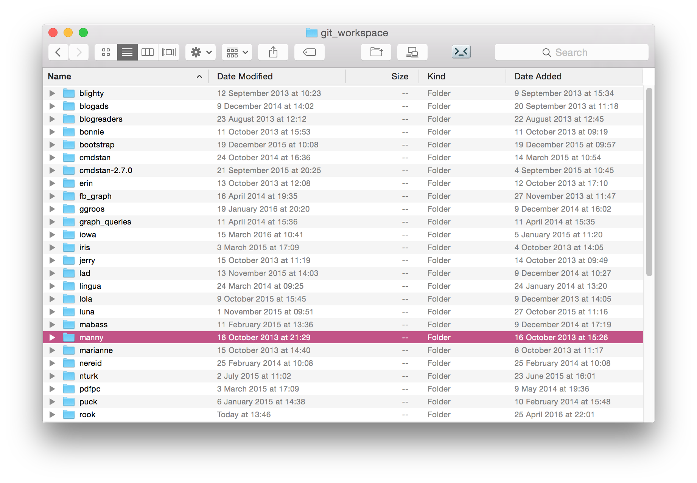
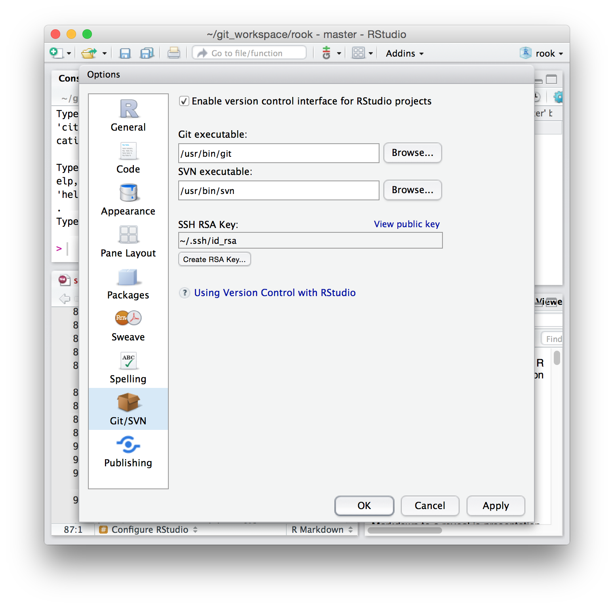
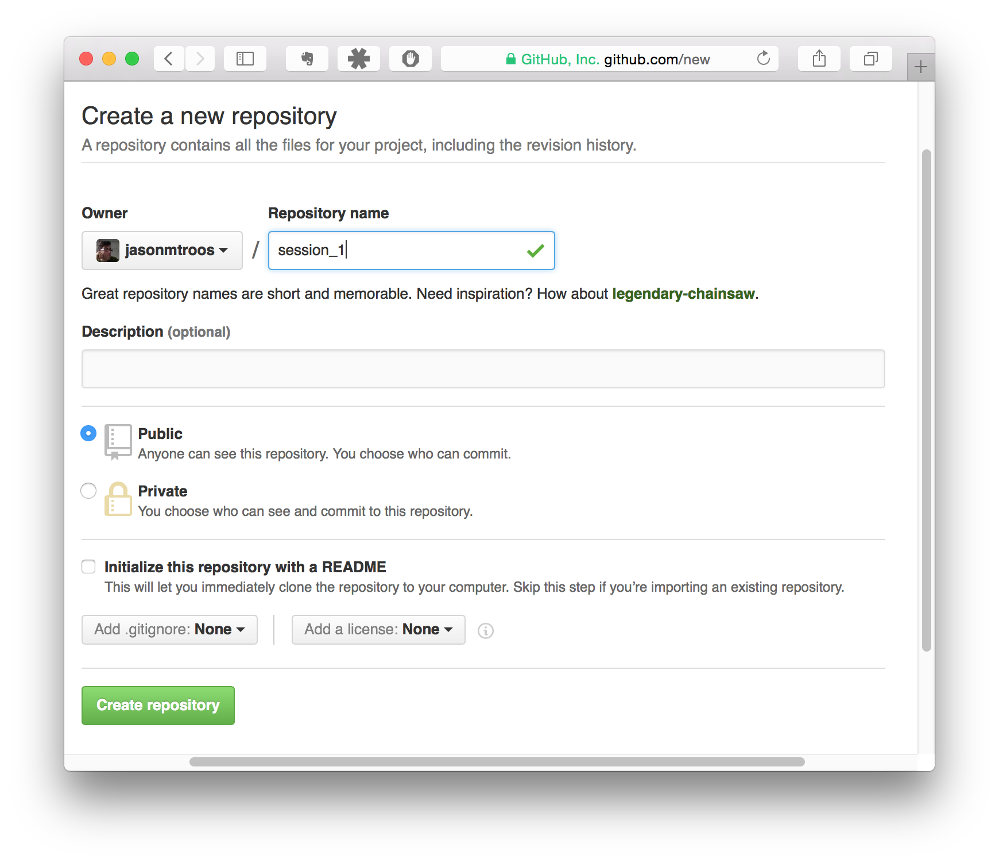
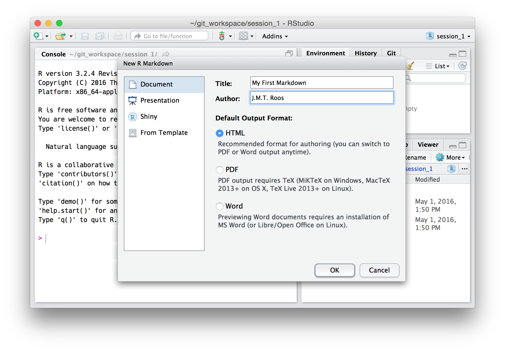
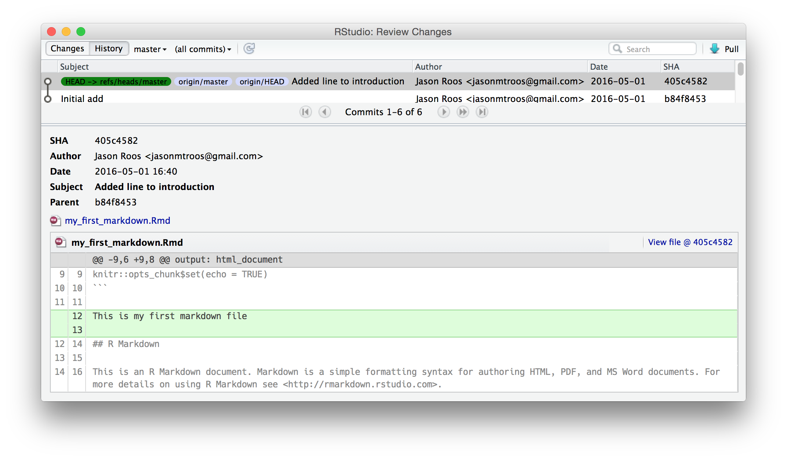

```{r echo=FALSE, include=FALSE, eval=FALSE}
cat(knitr::knit_theme$get('solarized-light')$highlight)
```
```{r echo=FALSE, include=FALSE}
knitr::opts_chunk$set(tidy = TRUE)
knitr::knit_hooks$set(
source = function(x,options){
  if( options$engine == 'R' ) {
    # format R code
    x = highr::hilight( x, format = 'html' )
  } else if( options$engine == 'bash' ) {
    # format bash code
    x = paste0( '<span class="hl std">$</span> ', unlist( stringr::str_split( x, '\\n' ) ), '\n', collapse = '' )
  }
  # for (i in names(options)) {
  #   message( paste( i, options[[i]] ) )
  # }
  x = paste(x, collapse = "\n")
  sprintf("<div class=\"%s\"><pre class=\"%s %s\"><code class=\"%s %s\">%s</code></pre></div>\n", 'sourceCode', 'sourceCode', tolower(options$engine), 'sourceCode', tolower(options$engine), x)
}
)
```


Learning by doing
==================================
* Coding is not as difficult as people think
* My approach to teaching people to code is to have them type (and click on) things they don't fully understand
* Because they are curious, they will then ask "Hmm...why did that work?"
* I then explain what's going on
* That's the approach we'll take today

Doing before understanding
===========================
* First, you will
    + Set up a local workspace
    + Configure your source control software
    + Create an online repository for your work
    + Set up your local project files
    + Track them using version control
    + Make edits, commit changed, push changes to the online repository, etc.
* Later, I will explain what all this means

Setup your local working directory
==================================
*Do this once for each computer you work on*

* Create a top-level directory where all of your code will go
* Each project will have in its own directory underneath this one
* I call mine `git_workspace` -- I will use this name as a placeholder throughout these slides

***
<div class='center'>

</div>

Tell git who you are
==================================
* Start a new **terminal** (OS X) or **bash** (Linux) or **git-bash** (Windows) session
* Execute the following commands, substituting your information
* **Note:** Use the email address associated with your **GitHub** account

```{r engine='bash', eval=FALSE, highlight=TRUE}
git config --global user.name "John Doe"
git config --global user.email "johndoe@example.com"
```

* OS X users might need to issue the following commands as well

```{r engine='bash', eval=FALSE, highlight=TRUE}
git credential-osxkeychain
git config --global credential.helper osxkeychain
```

Configure RStudio
=================================
*	Open **RStudio**
*	Select the menu item **Tools > Global Options...**
* Click on the **Git/SVN** button
* Check the box that enables version control
* Quit **RStudio**

***
<div class='center'>

</div>

Create a new repository on GitHub
==================================
*Do this once for each project you work on*

* Log into **GitHub** (https://github.com)
* Click on **New repository** 
* Enter the name `session_1` and click **Create repository**

***
<div class='center'>

</div>

Get the URL for your new repository
=====================================
* Click on the **HTTPS** button under **Quick Setup** and copy the URL to your computer's clipboard
* I use `https://github.com/jasonmtroos/session_1.git` in subsequent examples
* **Note:** Your repository is *empty* in the sense that you have not added any files to it yet

***
<div class='center'>

</div>


Create a new RStudio project
=================================
* Open **RStudio**
* Select **File > New Project...**
* Click on **Version Control** and then on **Git**
* Paste the URL you copied from Github into the **Repository URL** field
* Hit tab, then ensure **Project directory name** is set to `session_1`
* Under **Create project as subdirectory of:** click **Browse...** and then navigate to your `git_workspace` directory

***
<div class='center'>

</div>

Create a new R Markdown file
================================
*Do this one or more times for each project you work on*

* Select **File > New File > R Markdown...**
* Set the **Title** to `My First Markdown`
* Enter your name as the **Author** and click **OK**

***
<div class='center'>

</div>

Save your new R Markdown file
===============================
* Select **File > Save**
* Name the file `my_first_markdown.Rmd` and make sure it gets saved into `git_workspace/session_1` (this should be the default)

***
<div class='center'>

</div>

Tell git to keep track of your new file(s)
===========================================
* Click on the **Git** tab in the upper right panel
* Check each of the boxes next to the three files listed
* Click on the **Commit** button
* In the window that pops up, type `Initial add` in the **Commit message** window

***
<div class='center'>

</div>

Commit your changes
==========================
* Click **Commit**
* **RStudio** will now interact with **git** behind the scenes
* When they are done, **RStudio** will open a small window showing what **git** had to say

```
[master (root-commit) 2757d93] Initial add
 3 files changed, 47 insertions(+)
 create mode 100644 .gitignore
 create mode 100644 my_first_markdown.Rmd
 create mode 100644 session_1.Rproj
```

Push your changes to GitHub
==============================

* Click on the **Push** button in the top right corner
* If you receive the following error...

```
error: unable to read askpass response from 'rpostback-askpass'
fatal: could not read Username for 'https://github.com': Device not configured
```

* ...click on the **Gear icon > Shell...** and type

```{r, engine='bash', eval=FALSE}
git push
```

* ...then enter your **GitHub username** and **password** when prompted

```
To https://github.com/jasonmtroos/session_1
   f5d8fc0..dbea7bb  master -> master
```

Compile your R Markdown file
===============================
* Click on the **Knit** button
* Your file will be used to generate a new HTML document, which will be displayed in a special document viewer window

Make a change to your R Markdown file
=======================================

* Change the boilerplate text in the R Markdown file you just created by inserting `This is my first markdown file.` above `## R Markdown`

```{r echo=FALSE, comment=''}
cat( '```{r setup, include=FALSE}\nknitr::opts_chunk$set(echo = TRUE)\n```\n\nThis is my first markdown file.\n\n## R Markdown\n\nThis is an R Markdown document. Markdown...\n')
```
* Save your changes by selecting **File > Save**
* Click on **Knit** again to see how your file has changed

Commit your changes and push them to GitHub
=========================================
*Do this whenever you make changes to your file you want to keep*

* Click on the **Git** tab
* Check the box next to `my_first_markdown.Rmd` (ignore the file ending in `.html` for now)
* Click on **Commit**
* Enter the commit message `Added line to introduction`
* Click on **Commit** (*NB: not the same button as in the previous step*)
* Click on **Push**
* Close the dialog showing the output from **git**

View your file's history
========================
*Do this when trying to figure out where and when you introduced a mistake into your file*

* Highlight `my_first_markdown.Rmd` and then click on the **History** button
* You will see a summary of all versions of this file that you have previously committed to your local **git** repository

***
<div class='center'>

</div>

View your remote repository
===========================

* Go to (https://github.com/jasonmtroos/session_1) substituting your **GitHub username** for mine
* Here you will see the current state of your repository after your last **Push**
* If you click on `my_first_markdown.Rmd` and then the **History** button you will see a similar summary to the one provided by **RStudio**


What you've done so far
=======================
1. Set up your workspace
2. Created a git repository on GitHub and cloned it into your local workspace
3. Created an RStudio project and added an R Markdown file to it
4. Compiled your R Markdown file into an HTML document
5. Committed your edits to git and pushed them to GitHub
6. Viewed your commit history

What's next
======================================
* Install a few packages in R
* Edit your R Markdown file so that it does something useful
* Get used to keeping track of files using git
* Understand how git, R, RStudio, and R Markdown can help you become a more organized and efficient researcher

Installing packages
====================
* Install the `readr` package by typing the following command in the **Console** window

```{r eval=FALSE}
install.packages('readr', dependencies=TRUE)
```

* If the package has been loaded sucessfully, you should be able to execute the following command without producing an error

```{r}
library(readr)
```

A few more packages
===================
* Install the following packages

```{r eval=FALSE, echo=FALSE}
#packages_to_load <- c('devtools', 'dplyr', 'foreign', 'ggplot2', 'Hmisc', 'httr', 'jsonlite', 'lubridate', 'magrittr', 'plyr', 'RColorBrewer', 'RCurl', 'readxl', 'reshape2', 'rvest', 'scales', 'stringr', 'tidyr', 'tm', 'twitteR', 'xml2')
```

```{r eval=FALSE}
packages_to_install <- c('ggplot2', 'RColorBrewer','Hmisc')
install.packages( packages_to_install, dependencies = TRUE )
```

* If any of these fail to install, make a note of which ones and let me know

Edit your R Markdown file
=========================

* Delete everything that comes *after* the following lines of code

```{r echo=FALSE, comment=''}
cat( '```{r setup, include=FALSE}\nknitr::opts_chunk$set(echo = TRUE)\n```\n\n[Deleted from this point forward]\n')
```

* We will now do something useful with this file...
* Edit your file to include the code in the following slides

Download data
========================

* Add this code to your R Markdown file

```{r echo=FALSE, comment=''}
cat( 'Download sleep study data\n```{r}\nlibrary(readr)\nsleep <- read_csv("https://vincentarelbundock.github.io/\n    Rdatasets/csv/lme4/sleepstudy.csv") # no spaces\nhead(sleep)\n```' )
```

* Click on **Knit**

Commit your changes
===================

* Click on the **Git** tab
* Check the box next to `my_first_markdown.Rmd` (ignore the file ending in `.html` for now)
* Click on **Commit**
* Enter the commit message `Replaced boilerplate with code to download sleep study data`
* Click on **Commit**
* **Do no** click on **Push**

Committing and pushing
======================
* The change you just committed is reflected in your *local* git repository and its history (viewable via RStudio)
* This change will not be reflected on GitHub until you *push* those changes
* In general, you make many changes locally (committing them as you go) and then push them to GitHub less frequently

Plot the data
===============

* Add this code to your R Markdown file

```{r echo=FALSE, comment=''}
cat( "Plot the data by subject\n```{r}\nlibrary(ggplot2)\nggplot(sleep, aes(x = Days, y = Reaction)) +\n  geom_point() +\n  geom_smooth() +\n  scale_x_continuous(breaks = seq(0,8,by=2)) +\n  facet_wrap(~Subject)\n```" )
```

* Click on **Knit**

***
<div class='center'>

</div>

Group and summarise
===========================
* First, install the `dplyr` package

```{r eval=FALSE}
install.packages('dplyr',dependencies=TRUE)
```

* Next, add this code to your R Markdown file

```{r echo=FALSE, comment=''}
cat( "Summary statistics by subject\n```{r}\nlibrary(dplyr)\nsleep %>%\n  group_by(Subject) %>%\n  summarise(mean(Reaction))\n```" )
```

***

```{r echo=FALSE, comment=''}
cat( "Mean-center reaction times and plot on a single axis\n```{r}\nsleep %>%\n  group_by(Subject) %>%\n  mutate(mean_centered_reaction = Reaction - mean(Reaction)) %>%\n  ggplot(aes(x = Days, y = mean_centered_reaction,\n      colour = factor(Subject))) + \n    geom_smooth(show.legend = FALSE, se = FALSE) +\n    scale_x_continuous(breaks = seq(0, 8, by = 2))\n```" )
```


Commit your changes and push them to GitHub
=========================================

* Click on the **Git** tab
* Check the box next to `my_first_markdown.Rmd` (ignore the file ending in `.html` for now)
* Click on **Commit**
* Enter the commit message `Added code to create plot by individual`
* Click on **Commit** 
* Click on **Push**
* Close the dialog showing the output from **git**


Why are we doing all of this?
=============================

1. Workspace organization and git
2. Automation and reproducibility via R Markdown

Because without these practices, you cannot expect to successfully manage work that involves large and/or disparate data sets


Workspace ideas
===============
* Each project has its own folder under `git_workspace`
* There are files you are allowed to change, and files you can never change
    + *Raw* (i.e., original) data files can never be changed
    + If a file can be changed, it must live under `git_workspace/project` with changes tracked by **git** or some other *version control* software
    + Data files can also live under `git_workspace/project/data-raw` provided you never alter them
    + Altered data files should be placed in a different directory from the originals (e.g., in `git_workspace/project/data`)

Reproducibility and automation ideas
====================================
* Your data management code and analysis should be transparently documented and controlled by a repeatable, automated process (e.g., by knitting an R Markdown file)
* You (or someone else) should be able to reproduce your analysis exactly by 
    + Cloning the git repository
    + Opening RStudio
    + Knitting your R Markdown file
* ...or... by reading the HTML output of your R Markdown file and entering commands directly into R exactly as they appear in the HTML file

More about git
==========================
* git is a command-line tool, but RStudio (and a few other tools) offer GUI's for performing simple tasks
* My goal for this course is that everything we do with git can be performed via RStudio's interface
* There is much, much, much more that git can do:
    + Merging changes made by multiple collaborators
    + Creating different versions of the same code based for different purposes
    + Committing changes to experimental code without affecting the main code base
    + Creating a snapshot that records what your code looked like at the point you submit a manuscript
* If you want to know more about git, check out [GitHub's list of resources for learning git and GitHub](https://help.github.com/articles/good-resources-for-learning-git-and-github/)

More about R Markdown
=====================
* Based on the idea of *literate programming*
* Simple rules for formatting text as HTML (or PDF via latex)
* Code can be inserted inline with other text using special 
  delimiters
* When compiling the markdown file, the code is executed and 
  results are inserted into the final HTML file

```{r}
5 * 10 + 2
```

Like so.

R Markdown example
==================
This is the code I used to generate the preceding slide.

<div style="height:490;">
```{r echo=FALSE, comment = ''}
cat("More about R Markdown\n=====================\n* Based on the idea of *literate programming*\n* Simple rules for formatting text as HTML (or PDF via latex)\n* Code can be inserted inline with other text using special\n  delimiters\n* When compiling the markdown file, the code is executed and\n  results are inserted into the final HTML file\n\n```{r}\n5 * 10 + 2\n```\n\nLike so.\n")
```
</div>

More about R Markdown
=====================
* This is relatively easy to learn, and you should do so
* In particular, you can control how your code is processed, the size of graphics, etc. via code that looks like this: `` ```{r fig.width=5, fig.height=4}``
    + Code like `fig.width = 5` is processed by a package called `knitr` if you want to learn more about customizing output
* RStudio has [an entire site](http://rmarkdown.rstudio.com) dedicated to the R Markdown file format, which you should visit and read this week


What you need to do this week
=============================
1. Get your R environment in order (see next slide)
2. Get familiar with R Markdown (**mandatory**) and git (*optional*) -- see previous slides for links
3. Follow the [R tutorials](http://www.jasonmtroos.com/assets/media/teaching/course_assignments_and_data.zip) I developed for my Marketing Analytics MSc course
    * Assignment 1 -- learning R (*optional* unless you are lost right now)
    * Assignment 2, sections 1--2 -- linear and logistic regression (*optional* -- not related to the purpose of this course)
    * Assignment 3, section 2 -- ggplot2 (**mandatory**)
    * Assignment 4 -- more ggplot2 and dplyr (**mandatory**)


Get your R environment in order
===============================

```{r eval=FALSE, tidy=FALSE}
these_packages <- c('devtools', 'dplyr', 'foreign', 'ggplot2',
                    'Hmisc', 'httr', 'jsonlite', 'lubridate', 
                    'magrittr', 'plyr', 'RColorBrewer', 'RCurl', 
                    'readxl', 'reshape2', 'rvest', 'scales', 
                    'stringr', 'tidyr', 'tm', 'twitteR', 'xml2')
install.packages(these_packages, dependencies = TRUE)
```

* Windows users might need to install **RTools**, which provides the necessary toolchain for compiling R packages from source code
    * See (https://CRAN.R-project.org/bin/windows/Rtools/) choosing the default "Package authoring installation" during installation


These slides
============
* To download these slides (more specifically, the R Markdown files that create them), you will need to use git and terminal or git-bash

```{r engine='bash', eval=FALSE}
cd git_workspace
git clone http://github.com/jasonmtroos/rook
```

* You can then open `git_workspace/rook/rook.Rproj` in RStudio and compile the R Markdown files (listed under subdirectories -- see the **File** panel)
* To get the latest version, you can **pull** from GitHub

```{r engine='bash', eval=FALSE}
cd git_workspace/rook
git pull
```
