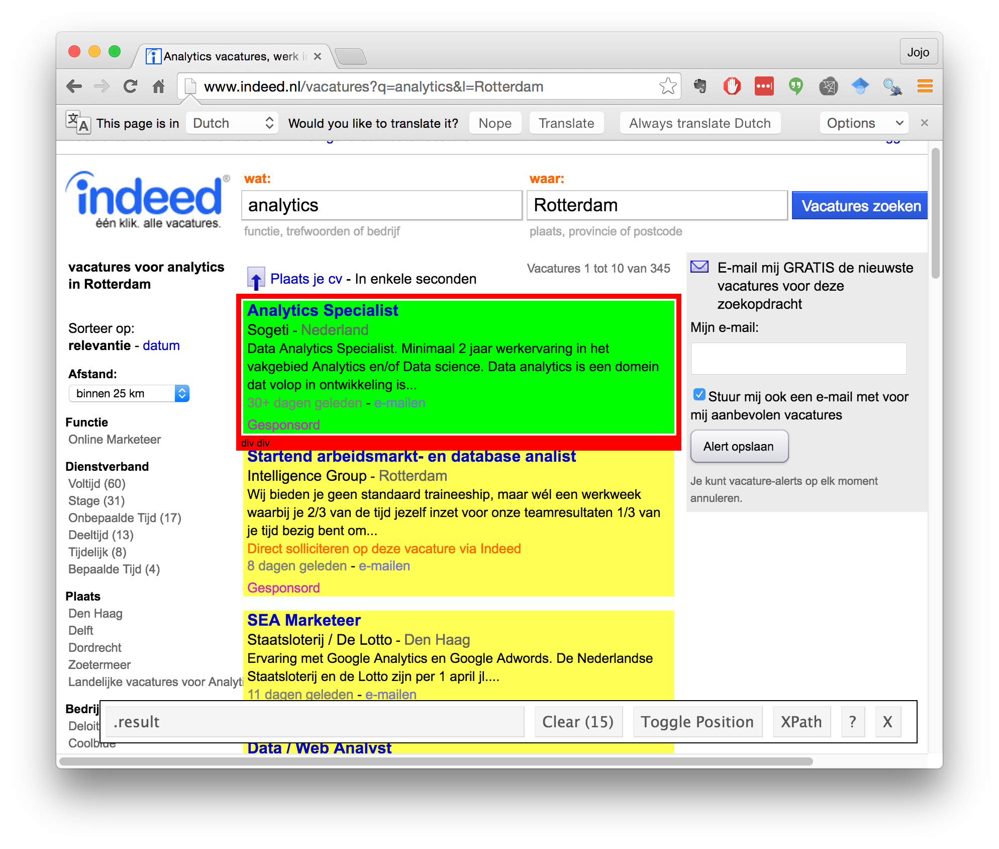

```{r setup, include=FALSE}
knitr::opts_chunk$set(echo = TRUE, tidy = TRUE)
```

Open a web browser and visit [http://www.indeed.nl/vacatures?q=analytics&l=Rotterdam](http://www.indeed.nl/vacatures?q=analytics&l=Rotterdam). Our goal is to collect information about this list of ~345 jobs. 


Load the rvest library

```{r}
library(rvest)
```

Create a new browsing session

```{r}
session <- html_session( 'http://www.indeed.nl/vacatures?q=analytics&l=Rotterdam' )
session
```

Switch to your browser and use InspectorGadget to find the CSS selector corresponding with the search results.



The selector is `.result`. According to InspectorGadget, there are 15 items matching the selector `.result`, but the HTML page indicates you are looking at the first 10 search results. This is because some of these results are sponsored.

Take a look at the contents of the nodes.

```{r}
(results <- session %>% html_nodes( css = '.result' ))
```

We want the links to the job posting detail pages, which are contained inside `<a>` tags. The selector `a` returns too many results. After a little work with InspectorGadget, it appears `h2 > a` yields links to the normal search results, and `div.result > a:first-child` yields links to the sponsored search results.

```{r}
(normal_results <- session %>% html_nodes( css = 'h2 > a' ))
(sponsored_results <- session %>% html_nodes( css = 'div.result > a:first-child' ))
```

```{r echo = FALSE}
jk <- session %>% html_nodes(css = 'div.result') %>% html_attr('data-jk') %>% .[1]
```

Our goal is to scrape the content of the linked pages. But...what is the URL of the linked page? Switch to the browser and click on one of the links, then look at the URL. For example, I clicked on this one:

```{r echo = FALSE, comment = ''}
cat(paste0('http://www.indeed.nl/viewjob?jk=',jk,'&q=analytics&l=Rotterdam&tk=1aj1damgn9molfol&from=web&advn=2456921610110726&sjdu=CeD_uouUPQ4Qp0sjiue0Syb-d0Fgz3t6xrM1hMo54n37cLMoobMfw1FPyCZABK9-3qErRmHXcMUXKiEMdt7Q07br0ipm1N-KqJlpO8SydDO49l2MNzVeEgHah3-sYmQ1b8Jp3RIpEGGzQDPGOpFyE5FIfSxLuJKDAZC0QUMVRIc&pub=4a1b367933fd867b19b072952f68dceb'))
```

My guess is that `jk` is the id of the job. I verify this by trying `r paste0('http://www.indeed.nl/viewjob?jk=',jk)` in my browser -- it works! So we are interested in these `jk` values. There were 15 jobs listed, so we should find 15 of them on the first page, probably embedded in the 15 items matching the selector `.result`. But where are they stored? I need to search for the string <code class="r">`r jk`</code> somewhere in the search results. 

<pre class="r"><code class="r"><span class="identifier">jk</span> <span class="operator">&lt;-</span> <span class="string">"`r jk`"</span></code></pre>

The following query returns any nodes that contain the string `jk` in one of their attributes.

```{r}
results %>% html_nodes(xpath = paste0('//*[@*[contains(., "', jk, '")]]'))
```

```{r echo = FALSE}
len_jk <- results %>% html_nodes(xpath = paste0('//*[@*[contains(., "', jk, '")]]')) %>% length
```

The first job id (<code class="r">`r jk`</code>) is embedded in `r len_jk` different locations (note: depending on your search results, there might be a different number). The first node containing our job id is recognizable as the top-level `div` associated with each job. In that `div`, the job id can be found as the value of the `data-jk` attribute. Let's see if we can extract the job id's by reading the values of the `data-jk` attribute.

```{r}
(job_ids <- results %>% html_attr( 'data-jk' ))
```

That looks like a list of 15 job ids! 

But which ones are sponsored and which ones are not? Going back to the browser, we can see that the sponsored links include the word 'Gesponsord'. Using InspectorGadget, it appears the sponsored results are identified by the selector `.sdn`. The following query tests whether the results HTML includes a node matching the selector `.sdn`.

```{r}
(sponsored <- results %>% plyr::laply( .fun = function(n)length(html_nodes( n,'.sdn'))>0 ))
```

We can now store some information about the first set of search results:

```{r message = FALSE}
library(dplyr)
(jobs <- data_frame( id = job_ids, sponsored_result = sponsored ))
```

Do it again
===========

What about the next page of results? Using InspectorGadget, I determine that the "Next" ("Volgende") button can be found through the CSS selector `.pagination a:last-child`. Extracting that node yields the following.

```{r}
session %>% html_nodes( '.pagination a:last-child' )
```

Can we follow that link?

```{r}
(next_page <- session %>% html_nodes( '.pagination a:last-child' ) %>% html_attr('href') %>% jump_to( session, . ))
```

Does our earlier code work on the second page?

```{r}
(results <- next_page %>% html_nodes( css = '.result' ))
(job_ids <- results %>% html_attr( 'data-jk' ))
(sponsored <- results %>% plyr::laply( .fun = function(n)length(html_nodes( n,'.sdn'))>0 ))
(jobs <- bind_rows( jobs, data_frame( id = job_ids, sponsored_result = sponsored )) )
```

It does! Let's try another page:

```{r}
(next_page <- next_page %>% html_nodes( '.pagination a:last-child' ) %>% html_attr('href') %>% jump_to( session, . ))
(results <- next_page %>% html_nodes( css = '.result' ))
(job_ids <- results %>% html_attr( 'data-jk' ))
(sponsored <- results %>% plyr::laply( .fun = function(n)length(html_nodes( n,'.sdn'))>0 ))
(jobs <- bind_rows( jobs, data_frame( id = job_ids, sponsored_result = sponsored )) )
```

Now we can see the outline of a data collection routine: visit a page, extract the job ids (which we will process later), identify which ones are sponsored, and repeat for the next page in the search results. I write the following function to carry out these steps:

```{r}
process_results_page <- function( page ) {
  results <- page %>% html_nodes( css = '.result' )
  job_ids <- results %>% html_attr( 'data-jk' )
  sponsored <- results %>% plyr::laply( .fun = function(n)length(html_nodes( n,'.sdn'))>0 )
  jobs <- data_frame( id = job_ids, sponsored_result = sponsored )
  next_page_url <- page %>% html_nodes( '.pagination a:last-child' ) %>% html_attr('href')
    
  next_page <- NULL
  continue <- length(next_page_url) > 0
  if( continue ) {
    message( 'Jumping to page ', next_page_url )
    next_page <- jump_to( session, next_page_url )
  }
  return( list( jobs = jobs, continue = continue, next_page = next_page ) )
}
```

This function receives a `page` and returns a list containing a data frame of jobs, a `TRUE`/`FALSE` indicator of whether to continue processing search results, and an object containing the next page to search (if continue is `TRUE`).

To automate this procedure, we need a test that tells us when we are done. A test that works for this site (I discovered this through a bit of experimentation) is whether the "Next" link exists on the search results page.

```{r}
keep_going <- TRUE
page <- session
jobs <- data_frame( id = '', sponsored_result = TRUE )[NULL,]
while( keep_going ) {
  result <- process_results_page( page )
  jobs <- bind_rows( jobs, result$jobs )
  keep_going <- result$continue
  page <- result$next_page
}
```

We now have a data frame containing job id's:

```{r}
jobs
```

And we know how to construct a URL to the job detail page:

```{r}
job_detail_url <- function(job_id) {
  paste0('http://www.indeed.nl/viewjob?jk=',job_id) 
}
job_detail_url( jk )
```

Let's now look at the contents of one of those pages, using `r paste0('http://www.indeed.nl/viewjob?jk=',jk)` as an example. 

```{r}
(detail_page <- session %>% jump_to( job_detail_url(jk) ))
```

This time, InspectorGadget was not much help in identifying where the data is stored. Instead, I used "Inspect Element" in my web browser to identify the relevant CSS selectors. In this case, I found `.jobtitle`, `#job_header > .company`, `#job_header > .location`, and `.summary`.

```{r}
detail_page %>% html_nodes('.jobtitle') %>% html_text
detail_page %>% html_nodes('#job_header > .company') %>% html_text
detail_page %>% html_nodes('#job_header > .location') %>% html_text
detail_page %>% html_nodes('.summary') %>% html_text
```

We will now write a function to visit a page and extract the interesting data.

```{r}
process_detail_page <- function( job_id ) {
  detail_page <- session %>% jump_to( job_detail_url(job_id) )
  title <- detail_page %>% html_nodes('.jobtitle') %>% html_text
  company <- detail_page %>% html_nodes('#job_header > .company') %>% html_text
  location <- detail_page %>% html_nodes('#job_header > .location') %>% html_text
  summary <- detail_page %>% html_nodes('.summary') %>% html_text
  data_frame( id = job_id, title = title, company = company, location = location, summary = summary )
}
```

This function receives a job id, visits the relevant job detail page, and returns a data frame row containing the interesting data. We will call this function once for each job id. First, note that in our data frame of job id's, some are repeated (specifically, some of the sponsored results are repeated).

```{r}
jobs %>% distinct(id)
distinct_job_ids <- jobs %>% distinct(id) %>% getElement('id')
```

Ok, now here is the code to loop over the distinct job id's:

```{r}
job_details <- data_frame( id = '', title = '', company = '', location = '', summary = '' )[NULL,]
for( job_id in distinct_job_ids ) {
  current_job_detail <- process_detail_page(job_id)
  job_details <- bind_rows( job_details, current_job_detail)
}
job_details %>% glimpse
```

Our final step is to join the two data frames -- the data frame with the job id's includes an indicator of whether the job was presented as a sponsored search result. Because some of these jobs are presented both as sponsored and unsponsored (I learned this through experimentation), we want to know if the job is *ever* presented as sponsored:

```{r}
jobs <- jobs %>% group_by(id) %>% summarise(sponsored_result = any(sponsored_result))
```

Finally, we can join the two data frames:

```{r}
jobs %>% inner_join( job_details ) %>% glimpse
```