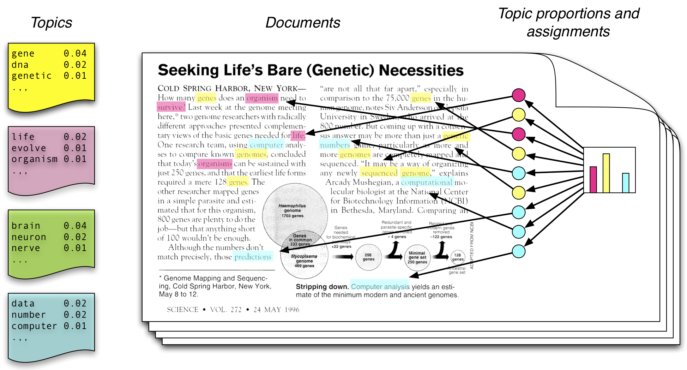

```{r echo = FALSE, include = FALSE, cache = FALSE}
knitr::opts_chunk$set(
  tidy = TRUE,
  tidy.opts = list(blank = FALSE, width.cutoff = 70),
  cache = 1
)
# knitr::knit_hooks$set(
# source = function(x,options){
#   if( options$engine == 'R' ) {
#     # format R code
#     x = highr::hilight( x, format = 'html' )
#   } else if( options$engine == 'bash' ) {
#     # format bash code
#     x = paste0( '<span class="hl std">$</span> ', unlist( stringr::str_split( x, '\\n' ) ), '\n', collapse = '' )
#   }
#   # for (i in names(options)) {
#   #   message( paste( i, options[[i]] ) )
#   # }
#   x = paste(x, collapse = "\n")
#   sprintf("<div class=\"%s\"><pre class=\"%s %s\"><code class=\"%s %s\">%s</code></pre></div>\n", 'sourceCode', 'sourceCode', tolower(options$engine), 'sourceCode', tolower(options$engine), x)
# }
# )
```


Review
==================================
* In class
    * HTML, CSS, and `rvest`
    * OAUTH2.0, JSON, `twitteR`
* During the week
    * Reviewing/learning the R programming language
    * Completing exercises (building a project, downloading data, etc.)
    * Installing `tm`, `lda`, and `topicmodels`
    * Completing the `tm` introductory tutorial


Today
========================================

1. Basic text manipulation tools
    * REGEX
    * `stringr`
2. Dictionary-based approach to text analysis
    * `tm`
3. Topic-based approach to text analysis
    * `lda`


REGEX
==============================
* Short for **regular expression**
* A sequence of characters that define a **search pattern**
* Used to locate matches inside of strings of text
* Examples

|REGEX  | Match(es) | Notes 
|-------|----------|--------
|z      |spoon7 | No matches 
|`.`    |`s` `p` `o` `o` `n` `7` | Each character matches
|`[sp]` |`s` `p` oon7 | `s` and `p` are matched separately
|`sp`   |`sp` oon7 | `sp` is matched as a whole
|`sp|on`|`sp` o `on` 7 | Means "or"
|`[^sp]`|sp `o` `o` `n` `7` | `^` negates the set `[sp]`
|`[m-q]`|s `p` `o` `o` `n` 7 | A range of characters


Repetitions
==================

* In addition to matching single characters and literal strings, can also match **multiples** of patterns

|REGEX| Definition|
|-----|-----------|
|`a*`  |Zero or more a's|
|`a+`  |One or more a's|
|`a?`  |Zero or one a's|
|`a{5}`|Exactly 5 a's|
|`a{3,}`|3 or more a's|
|`a{1,3}`|Between 1 and 3 a's|

* Matches are greedy: in 'aaaa', `a{2,4}` matches `aaaa` and not `aaa` or `aa`

|REGEX| Definition|
|-----|-----------|
|`a+?`  |As few a's as possible|
|`a{2,}`  |At least 2 a's, but as few as possible|

* These restrictions matter when you are using REGEX's to define how to substitute new text in for old text


Special characters
==================

|Character      |REGEX| Character     | REGEX|
|---------------|-----|---------------|------|
|`tab`          |`\t` | `^`           | `\^` |
|`new line`     |`\n` | `$`           | `\$` |
|`.`            |`\.` | `[`           | `\[` |
|`\`            |`\\` | `]`           | `\]` |
|`+`            |`\+` | `(`           | `\(` |
|`*`            |`\*` | `)`           | `\)` |
|`?`            |`\?` | `/`           | `\/` |
|`{`            |`\{` | `}`           | `\}` |

* In R, the backslash character `\` must be written as `\\` inside of strings

```{r}
cat('\\n')
```

* So to write `c:\` as a REGEX inside an R string, we write `c:\\\\`
* Four backslashes instead of 1? Really? Yes. Sorry.

stringr
===================
* The `stringr` package includes tools for detecting whether a string matches a REGEX pattern
    * The work is done by the `stringi` package, which is more flexible but harder to work with
* `stringr::str_detect(s, r)` returns `TRUE` if `s` can be matched by `r`

```{r cache = FALSE}
library(stringr)
s <- 'This is the string to be matched'
r <- 'm'
str_detect(s, r)
```

***

```{r}
library(stringr)
s <- 'This is the string to be matched'
r <- ' [^ ] '
str_detect(s, r)
```
* What does this REGEX mean?

```{r}
library(stringr)
s <- 'This is the string to be matched'
r <- ' [^ ]+ '
str_detect(s, r)
```
* Why does this one match?

*** 

* `str_match(s, r)[[1]]` will return the portion of `s` that was matched by `r`

```{r}
s <- 'This is the string to be matched'
r <- ' [^ ]+ '
str_match(s, r)[[1]]
r <- '(is ){2}'
str_match(s, r)[[1]]
r <- '(is )+?'
str_match(s, r)[[1]]
```

Task
==========

* Visit [www.regexr.com](http://www.regexr.com)
* Write a regular expression that matches all of the following words:
    * `Expression`
    * `expression`
    * `expressions`
* Your regular expression goes between `/` and `/g`
* When you're done, write REGEX's to match the following
    1. `Text` `text`
    2. `Save` `Favorites` but not `available`
    3. `Welcome` `RegExr` `Media` `Temple` `Edit` ... and all words that begin with a capital letter, but no spaces or punctuation
    4. `testing` and `test` but no punctuation
    
***


Task
=================
```{r}
library(stringr)
s <- 'This is hi$ fist'
```
* Write regular expressions in R using `str_match_all(s, r)` that produce the following matches
```{r echo = FALSE}
str_match_all(s, 'is') %>% unlist
str_match_all(s, 'i[s\\$]') %>% unlist
str_match_all(s, '[hf]ist?') %>% unlist
```


Text mining tools
====================
* REGEX --- for matching, extracting, and possibly transforming lines of text
    * `stringr` and `stringi` --- operate over vectors of character strings
* `tm` --- for applying the same extraction or transformation operations to large collections of text
    * For example, a set of documents, each of which is represented as a large character vector
    * Quickly generate and work with term-document matrices
* `lda` --- topical analysis of an already-cleaned collection of documents (e.g., previously prepared via `tm`)

Text mining with `tm`
=========================

1. **Collect** -- Organize texts from many sources in various formats in a single repository
2. **Clean** -- Pre-process the texts to make them easier to work with
3. **Transform** -- Generate numerical quantities based on the underlying texts for use in subsequent analysis
4. Subsequent analysis steps...


The `tm` package
===================

* The `Corpus` is a collection of related documents
    * Related documents are those that we want to analyze or transform or clean, all as a group
    * `tm` works with a variety of repository and file types (aka `Sources`)
    * When scraping data from the web, we typically just use a `VectorSource` (i.e., text are stored in character vectors)
* The `Document` is the basic unit of analysis, and might be a few short sentences (e.g., tweets) or a much longer text (e.g., a manuscript)
    * When specifying a `VectorSource`, each element of the character vector is considered a separate "document"
* The `TermDocumentMatrix` and `DocumentTermMatrix` are sparse matrices whose cells contain the number of co-occurances of each word in each document in the corpus


***

<div class="font-80">
```{r echo = FALSE}
# the html returned by this page is badly mangled, so I had to write this code to clean it up.
get_ufo_sightings <- function(url) {
  html <- httr::GET(url)
  html <-
    html$content %>% 
    rvest::repair_encoding() %>% 
    stringr::str_split('[\\r\\n]') %>% 
    .[[1]]
  tab_delims <- which(stringr::str_detect(html, 'TABLE'))
  table <-
    html[tab_delims[1]:tab_delims[2]] %>% 
    stringr::str_c(., collapse = '')
  xml2::read_html(table) %>% 
    rvest::html_node('table') %>% 
    rvest::html_table(.) %>% 
    dplyr::as_data_frame(.) %>% 
    dplyr::rename(., Date = `Date / Time`)
}
```

```{r message=FALSE, cache = FALSE}
library(tidyverse)
```
```{r message = FALSE}
ufos <- get_ufo_sightings('http://www.nuforc.org/webreports/ndxe201604.html') #see .Rmd file for source
ufos <- ufos %>% bind_rows(get_ufo_sightings('http://www.nuforc.org/webreports/ndxe201603.html'))
ufos %>% transmute(Date, City, Duration, Summary = str_trunc(Summary, 21)) 
```
</div>

* For this example, we will focus on `Summary`

```{r}
ufo_text <- ufos$Summary
```

***
```{r cache = FALSE}
library(tm)
```

```{r tidy=FALSE, message = FALSE}
ufo_corp <- Corpus(VectorSource(ufo_text)) %>%  # create corpus
  tm_map(content_transformer(tolower)) %>%      # lower case
  tm_map(removePunctuation) %>%                 # remove punctuation
  tm_map(removeWords, stopwords('english')) %>% # remove common words
  tm_map(stemDocument) %>%                      # reduce to word stems
  tm_map(stripWhitespace)                       # remove extra space 
ufo_corp
ufo_text[4] %>% str_wrap %>% cat
```

***

```{r}
tdm <- ufo_corp %>% TermDocumentMatrix
tdm_long <- with(tdm, data_frame(term = i, document = j, count = v)) 
tdm_long
```

***

```{r}
inspect(tdm[1:10, 1:6])
```

***

```{r}
inspect(tdm[535:545, 1:6])
```


***

* Use `dplyr` to aggregate counts across documents
```{r tidy = FALSE}
tdm_long <- tdm_long %>% mutate(term = factor(term, labels = Terms(tdm)))
tdm_long %>% group_by(term) %>% summarise(count = sum(count)) %>% 
  arrange(desc(count))  
```


***

* Alternative method to achieve same end from the `tidytext` package:
```{r}
tdm %>% tidytext::tidy()
```

***

* Find terms that appear 40 times or more:
```{r}
tdm %>% findFreqTerms(40)
```

***

* Find terms that correlate with some other term

```{r}
tdm %>% findAssocs("shape", .2) # cor(x,y) >= .2
tdm %>% findAssocs("sky", .13)
tdm %>% findAssocs("hover", .14)
```

***


"Bag-of-words" approaches to text tagging
=====================================

* Main idea: If a word has a particular meaning and appears in a particular document, then the document conveys in some sense the meaning of that word
* Examples:
    * If many of the words in a sentence were (previously) measured as highly emotional (e.g., *extremely* and *hate*), we construe the sentence to be highly emotional
    * If a document contains many such sentences, we assume the document is highly emotional
* The order of words does not affect inferences (as if the words were dropped into a bag)
* Term-document matrices are inputs to bag-of-words analysis


Scoring a term-document matrix
==============================

<div class="font-80">
```{r echo = FALSE}
stem_and_split <- function(x) {
  x %>% 
    VectorSource %>% 
    Corpus %>% 
    tm_map(stemDocument) %>% 
    .[[1]] %>% 
    as.character %>% 
    str_split(' ') %>% 
    .[[1]]
}
```
```{r}
words <- c('moving light night midnight minute white red pink orange yellow color star moon erratic flight slow wobble rotate hover pendulum speed eject shot climb dive') %>% stem_and_split() # see .Rmd for source
```

* Sums occurrances of terms within each document (very quickly)

```{r}
tdm %>% tm_term_score(words) %>% data_frame(document = names(.), score = .)
```
</div>


Sentiment
=========

* The bag-of-words approach can be used to measure the sentiment of documents in a corpus
* The current state of the art goes beyond the bag-of-words approach, taking advantage of word order, proximity to negating words, etc.
* But the underlying concept is the same --- some words are highly positive or negative, and if they occur in a sentence, then the sentence is probably positive or negative


Word lists
==============

* Typical lists include positive-negative, and VAD
* Top 99 percent V/A/D words:

```{r message = FALSE, warning = FALSE}
word_scores_url <- 'http://crr.ugent.be/papers/Ratings_Warriner_et_al.csv'
(words <- readr::read_csv(word_scores_url) %>% 
    select(Word, valence = V.Mean.Sum, arousal = A.Mean.Sum, dominance = D.Mean.Sum))
```

***

```{r}
words %>% gather(variable, value, -Word) %>% 
  group_by(variable) %>% 
  filter(percent_rank(value) > .99) %>% 
  ungroup %>% 
  arrange(Word)
```

High arousal words
=====================

* Get the scores for words scoring highest on arousal
* Then "stem" the words so they match with our UFO data

```{r warning = FALSE}
(arousal_words <- 
   words %>% 
   select(Word, arousal) %>% 
   filter(percent_rank(arousal) > .9) %>% 
   mutate(term = stemDocument(Word)))
```

Merge scores and TDM
======================
* Join scores with the term-document matrix (in long data frame form)

```{r message=FALSE, warning=FALSE}
tdm_long %>% inner_join(arousal_words)
```

UFO reports with highest arousal
==================================

* For each document, sum the arousal scores for any words it has in our list of high arousal words
* Arrange by score then print out the top 5 reports

```{r warning=FALSE, message = FALSE, comment = ""}
d <-
  tdm_long %>% 
  inner_join(arousal_words) %>% 
  group_by(document) %>% 
  summarise(score = sum(arousal)) %>% 
  arrange(desc(score)) %>% 
  top_n(5) %>% 
  getElement('document')
ufo_text[d] %>% 
  str_wrap(width = 70, exdent = 2) %>% 
  str_c("* ", .) %>% 
  cat(sep = "\n")
```

UFO reports with least arousal
====================================

```{r warning=FALSE, message = FALSE, comment = ""}
low_arousal_words <-
  words %>% 
  select(Word, arousal) %>% 
  filter(percent_rank(arousal) < .1) %>% 
  mutate(term = stemDocument(Word))
d <-
  tdm_long %>% 
  inner_join(low_arousal_words) %>% 
  group_by(document) %>% 
  summarise(score = sum(arousal)) %>% 
  arrange(score) %>% 
  top_n(5) %>% 
  getElement('document')
ufo_text[d] %>% 
  str_wrap(width = 70, exdent = 2) %>% 
  str_c("* ", .) %>% 
  cat(sep = "\n")
```


A New Approach
==============================

* If you use text mining, you might want to look at the `tidytext` package and its accompanying (free) text http://tidytextmining.com/ 

* The concepts are the same as we have already seen with `tm`, but the approach looks more like `dplyr`


Latent Dirichlet allocation
=============================

* What are the topics of these sentences?

```{r tidy=FALSE}
txt <- c('Abe is funny',
         'Abe is fat',
         'Bob is fat',
         'Cam is fat',
         'Cam is funny',
         'Cam is short',
         'Dee is funny')
```

* Which of the following seems like the right set of main topics?

```{r echo = FALSE}
library(lda)
lc <- 
  txt %>% 
  removeWords(stopwords()) %>% 
  stripWhitespace %>% 
  lexicalize  # create a special structure used by the lda package
K <- 4  # number of topics to detect
set.seed(1234)
f1 <- lda.collapsed.gibbs.sampler(lc$documents, K, lc$vocab, 500, .5, .1)
(top.words <- top.topic.words(f1$topics, 1, by.score = TRUE))
K <- 2  # number of topics to detect
set.seed(1234)
f1 <- lda.collapsed.gibbs.sampler(lc$documents, K, lc$vocab, 500, .5, .1)
(top.words <- top.topic.words(f1$topics, 1, by.score = TRUE))
```

***

{width=100%} \ 

`lda`
====
```{r echo = FALSE, cache = FALSE, results = 'hide'}
library(lda)
```

```{r}
library(lda)
lda_corp <-
  ufo_corp %>% 
  plyr::laply(as.character) %>% 
  str_replace('(^| )[0-9]( |$)', ' [number] ') %>% 
  str_replace('^ ', '') %>% 
  lexicalize
K <- 14  # number of topics to detect
set.seed(1234)
fit <-
  lda.collapsed.gibbs.sampler(lda_corp$documents, K, lda_corp$vocab, 500, .5, .1)
(top.words <- top.topic.words(fit$topics, 4, by.score = TRUE))
```

***

```{r message=FALSE}
get_topic_names <- function(fit) {
  # code copied from lda::top.topic.words:
  normalized.topics <- fit$topics / (rowSums(fit$topics) + 1e-05)
  scores <- apply(normalized.topics, 2, function(x) x * (log(x + 1e-05) - sum(log(x + 1e-05)) / length(x)))
  # end
  cutoff <- min(apply(scores, 1, function(x) max(x)))
  scores %>% 
    as.data.frame %>% 
    mutate(f = 1:nrow(.)) %>% 
    gather(key, value, -f) %>% 
    filter(value >= cutoff) %>% 
    group_by(f) %>% 
    arrange(f, desc(value)) %>% 
    summarise(name = paste(key, collapse = ' ')) %>% 
    getElement('name')
}
get_topic_names(fit)
```

***

<div class="font-90">
```{r echo = FALSE, results="asis"}
exemp_tab <- function(fit) {
  exemplars <-
    fit$document_sums %>% apply(1, function(x)
      x / sum(x)) %>% as.data.frame %>% mutate(d = 1:nrow(.)) %>% 
    gather(key, value, -d) %>% group_by(key) %>% 
    filter(value == max(value)) %>% group_by(key) %>% 
    filter(d == min(d)) %>% getElement('d')
  exemp <-
    data_frame(name = get_topic_names(fit), top = ufo_text[exemplars])
  pander::pandoc.table(exemp, style = 'rmarkdown', split.table = Inf, justify = 'll')
}
exemp_tab(fit)
```
</div>

***

* Assuming 5 topics rather than 14

```{r echo=FALSE, results = 'asis'}
K <- 5
set.seed(1234)
fit <- lda.collapsed.gibbs.sampler(lda_corp$documents, K, lda_corp$vocab, 500, .5, .1)
exemp_tab(fit) 
```

***

* No word stemming or stopword removal, and assuming 10 topics

```{r echo=FALSE, results = 'asis'}
ufo_corp_with_stops_no_stemming <- Corpus(VectorSource(ufo_text)) %>%  # create corpus
  tm_map(content_transformer(tolower)) %>%      # lower case
  tm_map(removePunctuation) %>%                 # remove punctuation
  tm_map(stripWhitespace)                       # remove extra space 
lda_corp_with_stops_no_stemming <- 
  ufo_corp_with_stops_no_stemming %>% 
  plyr::laply( as.character ) %>% 
  str_replace('(^| )[0-9]( |$)', ' [number] ') %>% 
  str_replace('^ ','') %>% 
  lexicalize

K <- 10
set.seed(1234)
fit <- lda.collapsed.gibbs.sampler(lda_corp_with_stops_no_stemming$documents,
    K, lda_corp_with_stops_no_stemming$vocab, 500, .5, .1)
exemp_tab(fit) 
```

***

* Four months of data, stemming and stopword removal

```{r echo=FALSE, results = 'asis', message = FALSE}
ufos <- bind_rows( 
  get_ufo_sightings('http://www.nuforc.org/webreports/ndxe201604.html'),
  get_ufo_sightings('http://www.nuforc.org/webreports/ndxe201603.html'),
  get_ufo_sightings('http://www.nuforc.org/webreports/ndxe201602.html'),
  get_ufo_sightings('http://www.nuforc.org/webreports/ndxe201601.html')
  )
ufo_text <- ufos$Summary

ufo_corp <- Corpus(VectorSource(ufo_text)) %>% 
  tm_map(content_transformer(tolower)) %>% 
  tm_map(removePunctuation) %>% 
  tm_map(removeWords, stopwords('english')) %>% 
  tm_map(stemDocument) %>%
  tm_map(stripWhitespace) 
  
lda_corp <- ufo_corp %>% plyr::laply( as.character ) %>% 
  str_replace('(^| )[0-9]( |$)', ' [number] ') %>% str_replace('^ ','') %>% lexicalize

K <- 10 
set.seed(1234)
fit <- lda.collapsed.gibbs.sampler(lda_corp$documents, K, lda_corp$vocab, 500, .5, .1)
exemp_tab(fit) 
```

***

* Same thing, but without stemming

```{r echo=FALSE, results = 'asis', message = FALSE}
ufo_corp <- Corpus(VectorSource(ufo_text)) %>% 
  tm_map(content_transformer(tolower)) %>% 
  tm_map(removePunctuation) %>% 
  tm_map(removeWords, stopwords('english')) %>%
  # tm_map(stemDocument) %>%
  tm_map(stripWhitespace) 
  
lda_corp <- ufo_corp %>% plyr::laply( as.character ) %>% 
  str_replace('(^| )[0-9]( |$)', ' [number] ') %>% str_replace('^ ','') %>% lexicalize

K <- 10 
set.seed(1234)
fit <- lda.collapsed.gibbs.sampler(lda_corp$documents, K, lda_corp$vocab, 500, .5, .1)
exemp_tab(fit) 
```


The `topicmodels` package
============================

* Similar functionality, just a different implementation

* Takes a `DocumentTermMatrix` object as input

```{r}
library(topicmodels)
control <- list(seed = 1, iter = 1500, burnin = 500)
dtm <- DocumentTermMatrix(ufo_corp)
set.seed(1234)
fit2 <- LDA(dtm, k = 10, method = 'Gibbs', control = control)
```


Output from `topicmodels`
==========================

```{r}
post <- posterior(fit2)
output <- 
  post$terms %>% 
  as_data_frame %>%
  mutate(topic = row_number()) %>%
  gather(term, value, -topic) %>%
  group_by(topic) %>%
  top_n(5, value) %>%
  ungroup %>%
  arrange(topic, desc(value), term) %>%
  group_by(topic) %>%
  summarise(terms = paste(term, collapse = ', '))
```

---

```{r}
output
```


Task
====

* Visit https://www.dropbox.com/s/adezcjlelf3puux/lovecraft_handout.html?dl=1 ...or...
* https://goo.gl/vQ94za


